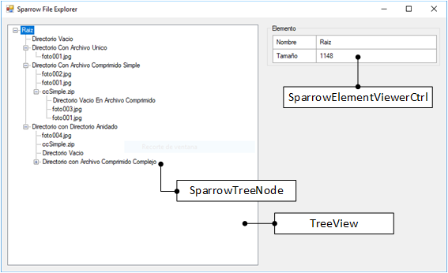

===============================
Práctica 07 - Patrón Iterator
===============================
---------------------------------------------------------------------------------------------
Sigue el camino de las baldosas amarillas [#f0]_
---------------------------------------------------------------------------------------------

.. [#f0] Famosa frase extraída del clásico del cine “El Mago de Oz” (Victor Fleming, 1939).

Introducción
=============

Los objetos de un sistema software no son normalmente elementos aislados e independientes unos de otros. Como es natural, estos elementos suelen conformar complejas redes  constituyen estructuras de tipos heterogéneos. Por tanto, se hace necesario, para diversos fines, disponer de mecanismos que permitan recorrer dichas estructuras de manera sistemática pasando por todos y cada uno de sus elementos. Por ejemplo, podría ser necesario recorrer dichas estructuras para encontrar un objeto concreto o modificar una serie de ellos, entre otros propósitos.

El objetivo del *patrón Iterator* es resolver el problema anteriormente descrito. Dado que este problema es bastante común y la solución proporcionada por el patrón Iterator es elegante y está comúnmente aceptada, dicho patrón se ha ido integrando en los lenguajes de programación actuales, como Java, C# o Python. Dichos lenguajes proporcionan interfaces predefinidas para la especificación de iteradores e, incluso, instrucciones especiales, como los *bucles foreach*, que permiten simplificar la manipulación de los iteradores.

El objetivo general de esta práctica es que el alumno adquiera familiaridad con el patrón Iterator, para lo que se aplicará dicho patrón a un problema concreto. La siguiente sección describe los objetivos de esta práctica de manera más detallada.

Objetivos
==========

Los objetivos concretos de esta práctica son:

  #. Comprender el funcionamiento general del patrón *Observer*.
  #. Comprender que pueden existir observadores de muy distinta naturaleza.
  #. Aprender a instanciar el patrón *Observer*.

Para alcanzar dichos objetivos, el alumno deberá realizar de forma satisfactoria una serie de actividades relacionadas con el problema que se describe a continuación.

Visualizador Gráfico del Sistema de Archivos Sparrow
======================================================

Por alguna razón que se desconoce, dentro de la *Isla Muerta*, localización donde se deberá ejecutar el sistema de archivos Sparrow, si, cuando accedemos a un enlace para recuperar su nombre, la clase correspondiente necesita acceder al elemento referenciado para recuperar su nombre, el rendimiento del sistema se ve gravemente afectado. Mientras los ingenieros de la organización *La Perla Negra* tratan de resolver este misterio, el cual se cree que tiene su origen en un maldición milenaria difícil de erradicar, se decide que los enlaces del *Sistema de Archivos Sparrow* almacenen el nombre de los elementos referenciados dentro del propio enlace. Este cambio en el diseño de la aplicación crea un nuevo problema a solventar que es que cuando se cambia el nombre de un elemento ``X`` se han de actualizar todos los enlaces que apunten a dicho elemento ``X``.

Además, para facilitar la gestión de los *Sistema de Archivos Sparrow*, se decide crear el *Explorador de Archivos Sparrow*, una interfaz gráfica para la visualización y manipulación de estos sistemas de archivos. La Figura 1 ilustra el aspecto de dicha interfaz.

   Figura 1. Interfaz Gráfica del Explorador de Archivos Sparrow

La interfaz gráfica del *Explorador de Archivos Sparrow* está compuesta por un *visualizador de árboles de archivos* (a la izquierda de la Figura 1) más un *visualizador de propiedades* de un elemento (a la derecha de la Figura 1). El *visualizador de árboles* se implementa mediante la clase ``TreeView``, proporcionada por la plataforma .NET. Esta clase visualiza una serie de elementos de la clase ``Node``. Para el caso concreto del *Sistema de Archivos Sparrow*, se ha creado una subclase de esta clase ``Node`` denominada ``SparrowNode``.

La clase ``SparrowNode`` simplemente añade a la clase ``Node`` una referencia al elemento concreto de un ``Sistema de Archivos Sparrow`` que visualiza dicho nodo. De esta forma cada elemento de un sistema de archivos es visualizado mediante su correspondiente ``SparrowNode``.

El *visualizador de propiedades* se implementa mediante un elemento gráfico o *widget* propio creado a través de la clase *SparrowElementViewerCtrl*. Esta clase contiene una referencia al elemento del *Sistema de Archivos Sparrow* cuyas propiedades esté visualizando, más un método interno *displayElement* que se encarga de refrescar el componente gráfico.

Actualmente tanto los *SparrowNode* como la clase *SparrowElementViewerCtrl* no se actualizan cuando el elemento referenciado cambia. Por tanto, se solicita  que, mediante la aplicación del patrón *Observer*, se solvente este problema.

Actividades
============

El alumno, para alcanzar los objetivos perseguidos, deberá completar las siguientes actividades:

  #. Añadir los enlaces al diseño creado para la práctica del patrón *Composite* en caso de que los enlaces no estuviesen aún añadidos. Si el alumno no sabe cómo hacerlo, deberá consultarlo con el profesorado de la asignatura, el cual le explicará con mucho gusto y en detalle como hacerlo.
  #. Hacer que los enlaces guarden dentro su clase, en un atributo, el nombre del elemento al que apuntan.
  #. Convertir a los enlaces en observadores de los elementos a los cuales apuntan, de manera que el nombre almacenado pueda actualizarse cuando los enlaces cambian.
  #. Descargar el proyecto proporcionado al final de esta sección, el cual  contiene el código inicial del *Explorador del Sistema de Archivos Sparrow*.
  #. Realizar las modificaciones necesarias en dicho proyecto para que compile y se pueda ejecutar correctamente.
  #. Convertir a las clases *SparrowNode* y *SparrowElementViewerCtrl* en observadores de elementos del *Sistema de Archivos Sparrow*, de manera que cuando estos elementos cambien, dichos cambios se reflejen en la interfaz gráfica.

.. note:: Junto con el proyecto moodle se proporciona otro formulario,   implementado por la clase ``FileNameEditor``, con el objetivo de permitir que
 los nombres de los elementos del sistema de archivos visualizado por el *Explorador de Archivos Sparrow* se puedan visualizar cómodamente. Por limitaciones de este editor, se recomienda no dar el mismo nombre a dos elementos del sistema de archivos, aunque estén sitos en directorios diferentes, ya que dicha situación podría provocar comportamientos anómalos.

:download:`Explorador de Archivos Sparrow <src/pr06/SparrowFileExplorer.zip>`
  Proyecto Visual Studio C# conteniendo la definición de las interfaces gráficas que conformarán el *Explorador de Archivos Sparrow*.

Criterios de Autoevaluación
============================

  #. Existe una interfaz o clase abstracta que representa a cualquier observador de un elemento *Sparrow*.
  #. Dicha clase abstracta o interfaz de observación permite notificar cualquier cambio que sea relevante en los objetos observados.
  #. Cada objeto que necesita actualizarse cuando un objeto *Sparrow* cambia implementa de manera adecuada la interfaz de observación.
  #. Los elementos *Sparrow* contienen un registro de observadores en el cual es posible tanto darse de alta como de baja.
  #. Todos los observadores de un objeto *Sparrow* ``x`` se registran como observadores en dicho objeto ``x`` tan pronto como se establece un vínculo con dicho objeto.
  #. Todos los observadores de un objeto *Sparrow* ``x`` se retiran del registro de observadores tan pronto  como un vínculo con dicho objeto ``x`` se deshace.
  #. Siempre que hay un cambio relevante en un objeto *Sparrow* se procede a notificar a sus observadores.
  #. Se evitan de alguna forma bucles infinitos por notificaciones cruzadas.
