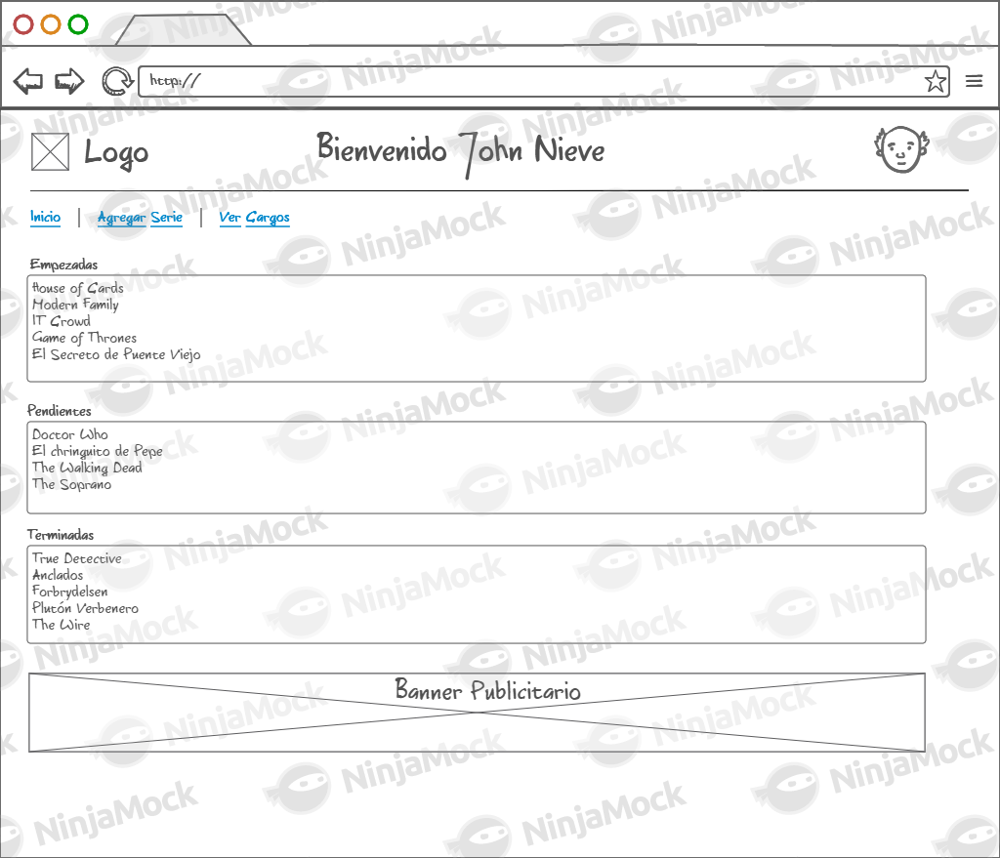
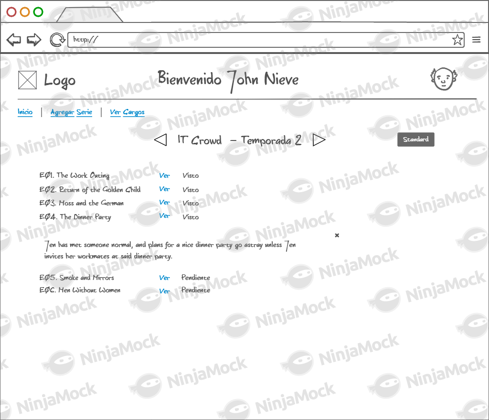
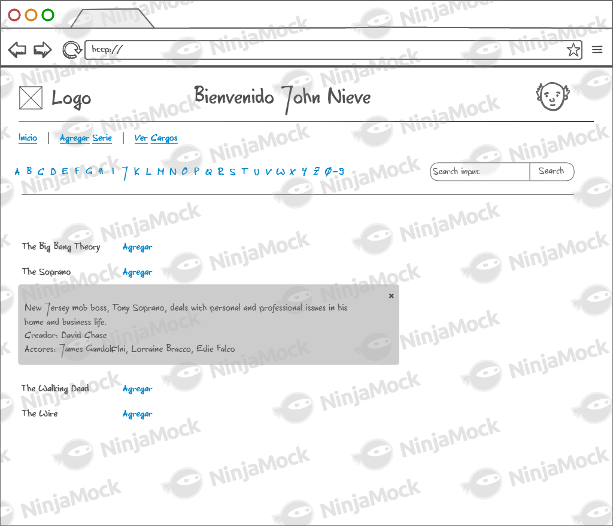
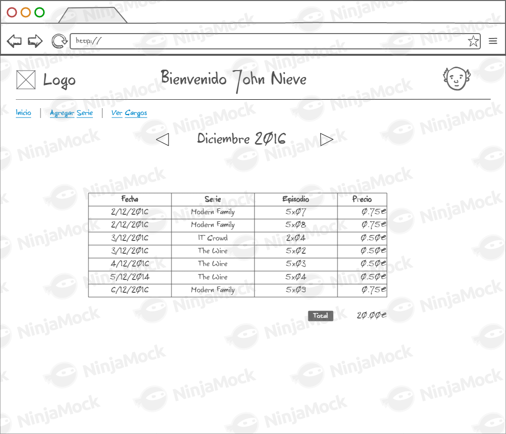

===================================
Práctica 09 - Domain-Driven Design
===================================

Introducción
=============

La filosofía o metodología de desarrollo `Domain-Driven Design <https://domainlanguage.com/ddd/reference/>`_ establece que la mejor estrategia para lidiar con la creciente complejidad de los sistemas software es crear, de manera colaborativa entre *stakeholders* y desarrolladores, un modelo que repesente el dominio del problema que dicho sistema software trata de resolver.

Dicho *modelo de dominio* contendrá una representación, lo más cercana posible a la realidad, de todos los aspectos del dominio de la aplicación que sean relevantes para la construcción del sistema software bajo desarrollo. Este *modelo de dominio* constituirá un *lenguaje univesal* que impregnará toda la aplicación y que será el nexo de unión entre desarrolladores y *stakeholders*.

Este modelo de dominio deberá especificar: (1) qué elementos constituyen el dominio de la aplicación, incluyendo tanto objetos como operaciones y eventos; (2) cómo se deben combinar dichos elementos y qué reglas se debe obedecer para componerlos; (3) las reglas que rigen las transformaciones que se pueden aplicar a cada objeto, o dicho de otra forma, las *reglas de negocio* que rigen el funcionamiento de dicho dominio.

Este *modelo de dominio* debe estar conectado de manera unívoca con una implementación que permita crear un puente claro entre el nivel al cual razonan los expertos en el dominio y el nivel al cual trabajan los desarrolladores. Por ello dicho modelo de dominio suele especificarse normalmente mediante la creación de un modelo de clases orientado a objetos. La filosofía de trabajo *Domain-Driven Design* aporta además una serie de reglas que ayudan a construir estos modelos de dominio de manera que puedan evolucionar fácilmente conforme el dominio que representan cambia y evoluciona.

El objetivo de esta práctica es que el alumno aprenda a crear *modelos de dominio* conforme al conjunto de reglas y buenas prácticas definido por la metodología *Domain-Driven Design*. Este objetivo principal se descompone en los subjetivos que se especifican en la siguiente subsección.

Objetivos
==========

Los objetivos concretos de esta práctica son:

  #. Comprender el funcionamiento básico de la metodología *Domain-Driven Design*.
  #. Aprender a crear modelos de dominio que represente el núcleo fundamental de un Sistema de Informacion Empresarial.
  #. Aprender a identificar *entities*, *value objects*, *services* y *aggregates*.
  #. Aprender a identificar diferentes tipos de *entities*.
  #. Aprender a implementar de manera correcta *aggregate roots*.

Para alcanzar dichos objetivos, el alumno deberá realizar de forma satisfactoria una serie de actividades relacionadas con el dominio de aplicación que se describe a continuación.

Polaflix: Un Sistema de Visualización de Series
================================================

Paco y Lola son dos oriundos de Polaciones que viven, por tanto, algo aislados del resto del mundo. A consecuencia de dicho aislamiento, Paco y Lola creen que el desarrollo de una plataforma web para la visualización de series de televisión bajo demanda es una idea innovadora y un proyecto de éxito seguro.

La idea básica del sistema es que cada usuario con cuenta en el sistema pueda buscar una serie, añadirla a su espacio personal y visualizarla. Por cada capítulo visualizado, se cobrará al usuario una pequeña cantidad. Los cargos se van acumulando en la cuenta del usuario y al final de cada mes se carga el recibo en la cuenta bancaria proporcionada por cada usuario.

Las series que ofrece el sistema se clasificarán inicialmente en tres categorías:
    #. **Estándar**: series de menor demanda o actualidad (e.g., Los Serrano);
    #. **Silver**: series de demanda o actualidad media (e.g., Paquita Salas);
    #. **Gold**: para series de gran demanda y actualidad (e.g., Juego de Tronos).

La visualización de un capítulo de una serie estándar se cobrará inicialmente a 0.50€; el capítulo de una serie silver a 0.75€; y el de una serie gold a 1.50€. Para los grandes consumidores de series existe la opción de pagar una cuota fija mensual de 20€ con la que poder visualizar todos los capítulos de todas las series que se desee.

Cada usuario, para poder acceder a la plataforma, tendrá que proporcionar un nombre de usuario, que será único para cada usuario dentro de la plataforma, una contraseña de acceso al sistema y una cuenta bancaria en formato IBAN.

Mientras cuidan de su nutrida y hermosa cabaña bovina, Paco y Lola han diseñado una serie de *mock-ups* que ilustran cómo debería funcionar su aplicación. El funcionamiento de Polaflix, de acuerdo con dichos *mock-ups* diseñados, sería tal como sigue.

   Figura 1. Página personal de inicio de un usuario *Polaflix*

Tras autenticarse en el sistema, cada usuario accede en primer lugar a su espacio personal (Figura 1). Dicho espacio personal deberá mostrar, para cada usuario, la lista de series que actualmente está viendo (etiquetadas como ``Empezadas``), la lista de series que desea ver pero que aún no ha empezado (etiquetadas como ``Pendientes``), y la lista de series que ha terminado de ver (etiquetadas como ``Terminadas``).

El nombre del usuario se muestra en la parte superior de la página. En el caso de la Figura 1, el usuario sería *John Nieve*. Desde esta página, cada usuario puede realizar las siguientes acciones:

  #. Seleccionar una serie para su visualización;
  #. Agregar una nueva serie a la lista de pendientes;
  #. Comprobar el estado de la factura actual o visualizar las facturas ya cobradas.

Cada una de estas acciones se describen a continuación.

Seleccionar una Serie para su Visualización
---------------------------------------------

Si dentro de la página inicial (Figura 1) se selecciona una serie, de cualquier lista, la aplicación redirige a la interfaz ``Ver Serie`` (Figura 2). Esta página muestra, temporada por temporada, todos los capítulos que conforman hasta el momento la serie seleccionada.

   Figura 2. Interfaz ``Ver Serie``

Por cada capítulo se muestra el número de capítulo dentro de la temporada, su título, un enlace ``Ver`` que permite comenzar la visualización del capítulo, y, por último, una etiqueta que indica si el capítulo ha sido ``Visto`` o está ``Pendiente`` de visualización. Un capítulo se considera visto desde el mismo momento en el que comienza su reproducción. Es decir, el sistema no verifica que el capítulo haya sido visualizado de manera completa para marcarlo como visto.

Cuando se abre la interfaz ``Ver Serie``, si la serie a mostrar es una serie empezada, la interfaz se abre directamente por la temporada correspondiente al último capítulo visualizado. En el caso de que la serie a visualizar esté pendiente o terminada, se abrirá siempre por la primera temporada. Además, si dentro de esta interfaz, se hace *click* o *doble click* sobre el título de un capítulo, se deberá mostrar debajo de dicho título la descripción del correspondiente capítulo.

Por último, en la esquina superior derecha, junto al nombre de la serie, se deberá mostrar el tipo de serie de la que se trata: (1) *estándar*; (2) *silver*; o (2) *gold*.

Agregar una Nueva Serie
------------------------

Al seleccionar la opción *Agregar Serie* (Figura 1), se debe redirigir el usuario a la interfaz de navegación por el catálogo de la plataforma (Figura 3), la cual deberá mostrar el listado de todas las series disponibles.

   Figura 2. Interfaz ``Ver Catálogo``.

Para facilitar la visualización de dicha lista, esta interfaz sólo mostrará, en una misma página, las series que comienzan por una determinada inicial. Además, como era de esperar, la lista de series correspondientes a una misma inicial se listarán alfabéticamente ordenadas. Para facilitar la navegación por las diferentes letras del alfabeto, la interfaz deberá disponer en su parte superior de algún tipo de *widget* que permita cambiar la inicial que está siendo visualizada.

Junto a estos elementos se deberá incluir caja de búsqueda que permita buscar una serie directamente por su nombre. En este caso, si la búsqueda tiene éxito, la página deberá mostrar el listado de la inicial que corresponda con la serie encontrada destacada de algún modo dentro de dicho listado.  Si una búsqueda concluyese sin éxito, la página mostrará simplemente un cuadro de diálogo reportando el error.

Dentro del listado de series, al lado del nombre de cada serie se mostrará un enlace que permita agregar la serie a la página personal de cada usuario. Si la serie ya estuviese agregada, la acción no tiene efecto. Si la serie no estuviese previamente agregada, se incorporará a la lista de pendientes. En este caso, además se enviará una notificación a los amigos de dicho usuario para informarles de que ha empezado a seguir la serie, y, por tanto, es fuente potencial de *spoilers*.

Por último, si dentro del listado de series, se selecciona el título de una serie, se deberá abrir bajo su título una pequeña sipnosis de la misma, junto con los nombres del creador o creadores de la series, así como una lista con sus principales actores.

Comprobar Facturación
----------------------

Cuando se selecciona la opción *Ver Cargos* (Figura 1), la aplicación redirigirá al usuario a la interfaz de control de la facturación (Figura 4).

   Figura 2. Interfaz ``Ver Facturas``.

La interfaz de control de la facturación mostrará inicialmente la factura correspondiente al mes en curso. La factura de cada mes contendrá una entrada por cada capítulo visualizado en ese mes. Por cada entrada, se deberá mostrar:

  #. La fecha de visualización del capítulo.
  #. El nombre de la serie a la que pertenece el capítulo.
  #. La temporada y número del capítulo visualizado.
  #. El cargo correspondiente a dicho capítulo, en función de si pertenece a una serie *estándar*, *silver* o *gold*.

Por último, al final de cada factura se mostrará el importe total de la factura. En el caso de los clientes que opten por la opción de una cuota mensual fija, el importe total será siempre dicha cuota fija.

La interfaz deberá proporcionar además una serie de botones que permitan avanzar o retroceder el mes mostrado, de manera que sea posible la consulta y revisión de facturas correspondientes a meses anteriores al actual.

Actividades
============

El alumno, para alcanzar los objetivos perseguidos, deberá completar satisfactoriamente las siguientes actividades:

  #. Crear un modelo de dominio, bajo la forma de un diagrama de clases UML, para dar soporte al sistema *Polaflix*. Como resultado de esta actividad el alumno deberá entregar una imagen en formato png, que ilustre dicho diagrama. Si el diagrama fuese muy grande, puede dividirse en varias subimágenes.
  #. En un documento de texto aparte, especificar qué clases de las contenidas en el modelo de dominio son *entities, cuáles *value objects* y cuáles *services*.
  #. En el mismo documento del punto anterior, indicar cómo se agrupan las clases en *aggregates*, especificando en cada caso cuál es el *aggregate root*.
  #. Crear los repositorios que sean necesario para el almacenamiento de los *aggregate roots*, incluyendo en cada repositorio las operaciones que se consideren convenientes, junto con una breve justificación.
  #. Implementar como clases simples de Java, o *POJOS (Plain Old Java Objects)*, el *aggregate* que contenga a la clase que represente a los usuarios. Utilizar clases vacías, que solo contengan los atributos identificadores, para representar clases externas al *aggregate*.
